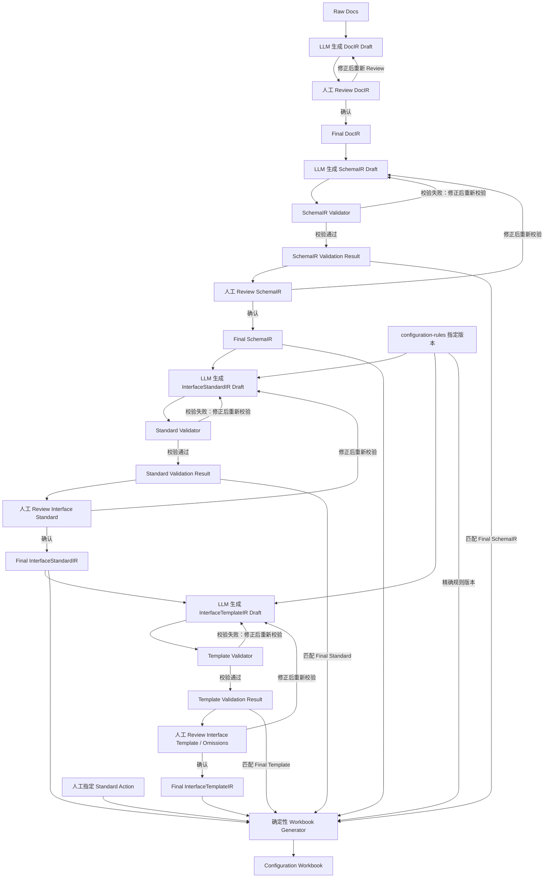

# 银行接口配置编译与 Configuration Workbook 需求文档

## Status

Draft.

## 1. 项目定位

本项目面向银企直连实施场景，将真实脱敏的银行接口文档整理为可 Review、可校验、可追溯、可回归的银行 XML 报文模型，并依次形成目标系统的接口标准、接口模板和供配置人员执行验收的 Configuration Workbook。

目标系统的真实配置顺序是：先配置接口标准，再基于该标准配置接口模板。两者通过 `interfaceCode` 关联，并按 `ASSEMBLY`（组装）与 `PARSE`（解析）方向分别管理。

项目目标不是全自动生成生产配置，也不承诺输出可直接导入目标系统的文件。LLM 只负责产生 Draft；Validator 和人工 Review 构成可信边界；最终工作簿只由已确认模型确定性生成。

| 阶段 | 定位 | 需求文档 |
|---|---|---|
| Phase0-PoC | 确认样例、格式、可信链路和技术边界，证明方向可行。 | `docs/phases/00-phase0-poc.md` |
| Phase1-MVP | 交付可重复运行、可 Review、可回归的最小产品能力。 | `docs/phases/01-phase1-mvp.md` |
| Phase2-Pilot | 在受控真实场景中试点，验证实施提效、配置质量和运维边界。 | `docs/phases/02-phase2-pilot.md` |
| Phase3-Production | 暂不定义目标和需求。 | `docs/phases/03-phase3-production.md` |

## 2. 核心产物与术语

IR 是 Intermediate Representation（中间表示）。它把来源不同、结构不同的信息转换为项目内部可持续处理的模型。

| 产物 | 更容易理解的名称 | 回答的问题 | 内容边界 | 可信状态 |
|---|---|---|---|---|
| `DocIR` | 结构化文档稿 | 银行文档写了什么？ | 章节、字段表、示例、条件、冲突、原文证据和不确定项。 | LLM 生成 Draft，人工确认后成为 Final DocIR。 |
| `SchemaIR` | 标准化报文模型 | 银行 XML 报文是什么结构？ | element、attribute、完整 path、父子层级、原始类型、必填、长度、出现次数和银行约束。 | LLM 生成 Draft，经 SchemaIR Validator 和人工 Review 后成为 Final SchemaIR。 |
| `InterfaceStandardIR` | 接口标准模型 | 目标系统应如何定义这个方向的报文字段格式和层级？ | 目标系统字段名称、描述、路径、必填、长度、非法字符、XML 内键、正则、数据类型和顺序。 | LLM 生成 Draft，经 Standard Validator 和人工 Review 后成为 Final InterfaceStandardIR。 |
| `InterfaceTemplateIR` | 接口模板模型 | 当前模板如何转换和赋值这些标准字段？ | 标准字段子集、字段与 XML 内键取值表达式、处理策略、规则依据、省略原因和人工结论。 | LLM 生成 Draft，经 Template Validator 和人工 Review 后成为 Final InterfaceTemplateIR。 |
| `Configuration Workbook` | 配置工作簿 | 配置人员要配置什么、依据是什么、执行与验证到哪一步？ | 一个方向标准的快照、一份模板、表达式明细、Warnings、规则引用和执行清单。 | 派生交付物，不是事实源。 |

“标准化报文模型”中的“标准化”只表示将不同银行文档统一为项目内部结构，不表示行业标准、XSD 或 JSON Schema。

本项目当前只承诺处理 XML 银行报文。各 IR 可以使用 JSON 作为机器可校验的序列化格式，但这不等于支持 JSON 银行报文。目标系统数据类型词汇中的 `List` 仅适用于 JSON，当前 XML 流程必须拒绝使用；JSON 报文能力是 future candidate。

## 3. 产品事实源与关联关系

项目采用三个相互独立、顺序关联的配置事实源：

- `Final SchemaIR` 保存银行报文结构和银行原始约束。
- `Final InterfaceStandardIR` 保存一个 `interfaceCode + direction` 下目标系统实际采用的接口标准。
- `Final InterfaceTemplateIR` 保存一份模板对所绑定标准字段的取值和处理配置。

三者不得相互覆盖。SchemaIR 与 InterfaceStandardIR 的 required、length、type 或其他约束存在差异时，必须同时保留两侧值；InterfaceStandardIR 记录差异原因、Rule ID 和人工 Review 结论，差异进入 Workbook `Warnings`。

一个方向标准可以被多份同方向模板复用。模板必须绑定不可变的 `standardId + standardVersion + contentHash`，不能仅凭 `interfaceCode` 自动跟随最新标准。标准升级后，已有模板仍指向原版本；迁移必须重新校验和 Review。

Configuration Workbook 不是事实源，不反向更新任何 IR。人工填写的执行状态、验证状态和备注也不回流 Final 模型。

## 4. 核心设计原则

- Human-in-the-loop 是必需能力。LLM 只能产生四类 IR Draft。
- Draft 未经对应 Validator（适用时）和人工 Review，不得成为 Final 产物。
- 接口标准必须在接口模板之前形成 Final；新增模板直接复用已确认的标准，不重新生成标准。
- Validator 只校验结构、引用和确定性 invariant，不能代替人工判断 function、mapping 或场景性字段省略是否符合业务语义。
- Workbook Generator 只做确定性格式化和配置指导，不补业务字段、不临时推断配置逻辑、不对接目标系统、不承诺导入兼容性。
- ASSEMBLY 与 PARSE 分别拥有独立的标准和模板，但模板取值使用同一套表达模型。
- 外部输入、LLM 输出和 third-party response 必须在信任边界处先校验。
- 真实银行文档和配置资料属于敏感输入，日志不得记录完整原文、凭证或 secret。
- 连接、认证、证书、部署或全量目标系统配置不属于上述 IR。

## 5. InterfaceStandardIR 能力

### 5.1 标准身份与字段

每份接口标准至少具有稳定内部 `standardId`、`interfaceCode`、`direction`、不可变版本和精确规则版本。每个标准字段至少表达：

- 稳定 `fieldId` 和同级 `sequence`；
- Field Name、Field Description；
- `parentPath` 与 `fullPath`；
- Required、Length Limit；
- Illegal Characters；
- XML Keys；
- Regex；
- Data Type；
- SchemaIR 来源、规则引用、差异、不确定性和人工 Review 结论。

目标系统配置中的 Path 表示父路径，因此映射为 `parentPath`。`fullPath` 包含当前字段名，用于唯一定位、审计和引用。例如 `Document` 的 parentPath 为 `Root`；`MsgId` 的 parentPath 可以为 `Root.Document.pain.001.001.02.GrpHdr`。

XML attribute 不形成独立接口标准行，而作为所属 element 标准行的 XML Keys，例如 `@version`。SchemaIR 仍独立保存银行 XML attribute 事实，不因目标系统的配置形态而丢失。同一 parent 下的 `sequence` 必须是唯一、连续的正整数，不能依赖当前数组或 Excel 行顺序隐式表达。

### 5.2 XML 数据类型

当前 XML 接口标准使用以下目标系统类型：

- `String`
- `Boolean`
- `Date`
- `Number`
- `Node`：XML 中可重复出现的无值容器节点。
- `Object`：XML 中不可重复的无值容器节点。

`List` 仅用于 JSON，不得出现在当前 XML Final InterfaceStandardIR。容器类型根据 SchemaIR 的层级、是否有值和出现次数确定；标量类型依据银行文档事实确定，信息不足时不得猜测。

### 5.3 约束状态

银行文档未给出长度、非法字符、正则等信息时，必须区分：

- `VALUE`：存在明确配置值；
- `NO_CONSTRAINT`：人工确认目标系统无需该约束；
- `UNKNOWN`：信息不足，尚未确定。

`UNKNOWN` 必须进入 Review，未经确认不得形成 Final InterfaceStandardIR。空值不能同时表示“无约束”和“尚不确定”。

## 6. InterfaceTemplateIR 能力

### 6.1 模板身份与标准引用

每份模板属于一个 `interfaceCode + direction`，具有稳定内部 `templateId` 和不可变版本，并精确绑定一个 Final InterfaceStandardIR 版本。一个标准可以关联多份模板，模板按方向独立，不在 ASSEMBLY 与 PARSE 间自动配对。

### 6.2 模板字段子集与 omission

模板字段是接口标准字段的合法子集：

- 同一模板中，一个标准字段最多出现一条模板行。
- 当前场景不需要报送或解析的标准字段可以没有模板行。
- 缺失字段产生 `MISSING_TEMPLATE_FIELD` Warning，而不是自动生成 `EMPTY` 行。
- 每个缺失字段必须保存 omission 记录，至少包含 `standardFieldRef`、省略原因和人工 Review 结论。
- omission 未确认时模板保持 Draft；人工确认有意省略后，允许形成 Final InterfaceTemplateIR。
- 已确认的 omission 仍保留在 Workbook `Warnings`，不得静默隐藏。

“不配置字段”与 `EMPTY` 不同：omission 表示该模板没有这个字段配置；`EMPTY` 表示该字段存在模板行且明确取空值。

同一标准字段通过 condition 配置多条模板行是已知 future candidate。本期不支持多行、不定义 condition wire 字段，Validator 必须拒绝重复 `standardFieldRef`。

### 6.3 取值表达式和处理策略

模板对两个方向统一支持：

- `FIXED_VALUE`
- `EMPTY`
- `FIELD`
- `FUNCTION`
- `MAPPING`
- `CONCATENATE`

`CONCATENATE` 按顺序包含任意模式的子表达式并允许递归。表达式必须保存为机器可校验的树，不能压缩成只能由自然语言解释的字符串。

模板行还表达：

- Empty Handling；
- Overlength Handling；
- Row Limit；
- Chinese Character Length；
- Ordered Replacement Rules；
- Rule References、confidence、不确定原因和人工 Review 结论。

ASSEMBLY 中，表达式描述系统数据如何转换为报文字段；PARSE 中，表达式描述报文字段如何转换为系统接收字段。

### 6.4 XML Key 表达式

接口标准 element 行只定义 XML Keys 的名称。若该标准字段存在模板行，每个 XML Key 必须在模板行中具有独立 Value Expression，例如 `@version → FIXED_VALUE("1.0")`。

模板行引用未知 XML Key 或缺少已定义 XML Key 的表达式时，Template Validator 必须报错。若整个标准字段已通过 omission Review 确认省略，其 XML Keys 随字段一起省略，不再要求单独表达式。

## 7. 正式规则资产

InterfaceStandardIR 与 InterfaceTemplateIR 的权威目标系统规则来源位于仓库顶层 `configuration-rules/`，不位于 `docs/reference/`。

规则包采用不可变版本目录。每条可被 IR 引用的规则使用稳定 Rule ID；字段、function 和 mapping catalog 保存目标系统原始标识和显示名称。每个 Final IR 记录自己实际使用的精确规则版本，不要求标准和后续模板必须使用同一版本。

当前 catalog 尚未提供，因此仓库只定义规则包维护契约。不得从历史 JSON、LLM 输出或相近概念推断 `v1` 内容。

## 8. 可信流程

人工 Review 修改 Draft 后必须重新运行对应 Validator，旧校验结果不得复用。Generator 只能接收三份 Final 模型、三份与 Final 内容匹配的通过校验结果、各自产物记录的精确规则版本和显式 Standard Action。

## 9. Configuration Workbook 成功标准

一份工作簿对应一个 `interfaceCode + direction + templateId + templateVersion`，固定包含：

- `Overview`
- `Interface Standard`
- `Interface Template`
- `Value Expressions`
- `Warnings`
- `Rule References`
- `Legend`

`Interface Standard` 保存模板所绑定标准的完整快照；`Interface Template` 只列出当前模板实际配置的字段。`Overview` 记录标准与模板身份、版本、内容摘要、规则版本、校验结果和调用者指定的 `Standard Action = CREATE | REUSE | UPDATE`。

`Value Expressions` 是模板表达式的结构化明细视图，不是额外事实源。主 sheet 只展示 Value Mode 和可读摘要；该 sheet 按树展开递归 `CONCATENATE`、function 参数和 mapping 引用，并通过 Expression Scope 区分字段值表达式与 XML Key 表达式。

`Warnings` 必须展示约束差异、字段 omission、规则冲突、不确定项和 Validator issue。已确认的场景性 omission 仍须显示原因和 Review Disposition；未确认 omission 不能进入 Final Template，因此不能生成可交付工作簿。

相同 Final 输入、校验结果、规则版本和 Standard Action 必须稳定生成相同结构化内容。工作簿不是目标系统导入文件，也不是 IR 的反向输入。

## 10. 目标用户

- 实施与配置人员：Review 四类 IR，使用 Configuration Workbook 人工配置接口标准和接口模板，并记录执行/验证状态。
- 开发人员：维护解析、Prompt、LLM adapter、Validator、规则资产、Workbook Generator、样例回归和工程护栏。
- 审核人员：检查 Final 模型、校验结果、规则版本、omission 结论和工作簿证据。系统不直接写入生产配置。

## 11. Out of Scope

- Import JSON 生成或兼容性承诺。
- 目标系统 API 写入、自动导入或生产库直连。
- 从 Excel 反向导入或更新任一 IR。
- 连接、认证、证书、部署和全量目标系统配置。
- 当前阶段的 JSON 银行报文及 `List` 类型配置。
- 同一标准字段多条模板行及 condition 选择逻辑。
- 未经业务负责人确认的字段、function 或 mapping catalog 推断。

## 12. 验收场景

文档、后续 wire contract、Validator 和 golden regression 必须覆盖：

- Interface Standard 的父路径、完整路径、同级顺序、`Node`/`Object`/标量映射和 XML Keys。
- `NO_CONSTRAINT` 与 `UNKNOWN` 明确区分，后者阻止 Final Standard。
- SchemaIR 与 InterfaceStandardIR 约束不一致时保留双方值、原因、Rule ID 和人工结论。
- 模板只配置标准字段的合法子集。
- 缺失模板字段产生 Warning；未确认 omission 阻止 Final，确认后允许 Final 且继续显示在 Workbook。
- omission 与 `EMPTY` 明确区分。
- `FIELD`、`FIXED_VALUE`、`EMPTY`、`FUNCTION`、`MAPPING` 和递归 `CONCATENATE`。
- 存在模板行时，每个 XML Key 都具有独立表达式；未知或缺失 Key 是错误。
- ASSEMBLY 与 PARSE 使用同一表达结构但绑定不同方向标准。
- `Value Expressions` 能还原字段值和 XML Key 的递归表达式树。
- 当前 XML 流程拒绝 `List`。
- Configuration Workbook 不被描述为可导入文件或 IR 的反向输入。

## 13. 跨阶段失败标准

出现以下任一情况，应视为当前阶段失败或需要调整范围：

- 任一核心 IR 只能人工从零编写，系统没有相应 Draft 生成能力。
- LLM 直接产生 Final 模型或最终 Configuration Workbook。
- 接口模板绕过未确认的接口标准生成或自动跟随未知最新版标准。
- Draft 未经要求的校验和人工确认即进入后续可信链路。
- 使用无来源规则、无法解析的 Rule ID 或不存在的 catalog 标识。
- 缺少 catalog 时由历史 JSON 或模型猜测补齐配置。
- 约束差异、模板 omission、规则冲突或不确定项被静默忽略。
- omission 被错误转换为 `EMPTY`，或未确认 omission 进入 Final Template。
- Workbook Generator 临时补业务字段、选择表达式或判断目标系统是否已存在标准。
- Configuration Workbook 不能从绑定版本的 Final 模型稳定重建，或不足以指导人工配置与验证。
- 当前正式文档或产品把 JSON 银行报文描述为已支持。

## 14. 文档维护规则

- 本文维护项目级产品契约；具体模型见 `docs/design/`，任务状态见 `docs/planning/`。
- 已形成约束的关键决策记录在 `docs/adr/`。
- `docs/reference/` 中的材料只能作为候选草案和参考输入。
- 规则资产必须遵守 `configuration-rules/README.md`，不能以普通设计文档替代。
