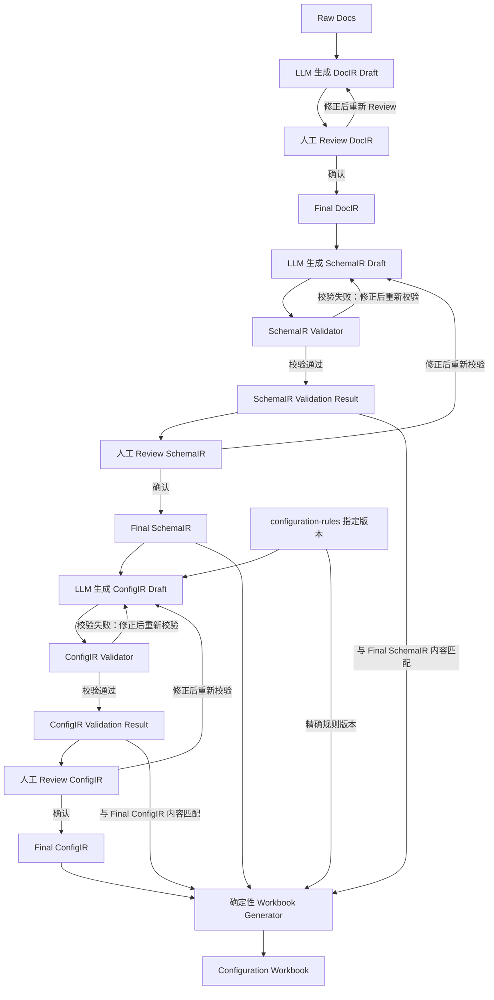

# 银行接口配置编译与 Configuration Workbook 需求文档

## Status

Draft.

## 1. 项目定位

本项目面向银企直连实施场景，将真实脱敏的银行接口文档整理为可 Review、可校验、可追溯、可回归的报文模型与目标系统配置模型，并确定性生成供配置人员执行和验收的 Configuration Workbook。

项目目标不是全自动生成生产配置，也不承诺输出可直接导入目标系统的文件。LLM 只负责产生 Draft；Validator 和人工 Review 构成可信边界；最终工作簿只由已确认模型确定性生成。

项目分为四个阶段：

| 阶段 | 定位 | 需求文档 |
|---|---|---|
| Phase0-PoC | 确认样例、格式、可信链路和技术边界，证明方向可行。 | `docs/phases/00-phase0-poc.md` |
| Phase1-MVP | 交付可重复运行、可 Review、可回归的最小产品能力。 | `docs/phases/01-phase1-mvp.md` |
| Phase2-Pilot | 在受控真实场景中试点，验证实施提效、配置质量和运维边界。 | `docs/phases/02-phase2-pilot.md` |
| Phase3-Production | 暂不定义目标和需求。 | `docs/phases/03-phase3-production.md` |

## 2. 核心产物与术语

IR 是 Intermediate Representation（中间表示）。它把来源不同、结构不同的信息转换为项目内部可持续处理的模型。

| 产物 | 更容易理解的名称 | 回答的问题 | 内容边界 | 可信状态 |
|---|---|---|---|---|
| `DocIR` | 结构化文档稿 | 银行文档写了什么？ | 章节、字段表、示例、条件、冲突、原文证据和不确定项。 | LLM 生成 Draft，人工确认后成为 Final DocIR。 |
| `SchemaIR` | 标准化报文模型 | 银行 XML 报文是什么结构？ | element、attribute、path、父子层级、类型、必填、长度、出现次数和银行原始约束。 | LLM 生成 Draft，经 SchemaIR Validator 和人工 Review 后成为 Final SchemaIR。 |
| `ConfigIR` | 系统配置模型 | 当前目标系统应如何配置这个报文字段？ | 字段取值表达式、字段处理策略、规则依据、差异、不确定性和人工 Review 结论。 | LLM 生成 Draft，经 ConfigIR Validator 和人工 Review 后成为 Final ConfigIR。 |
| `Configuration Workbook` | 配置工作簿 | 配置人员要配置什么、依据是什么、执行与验证到哪一步？ | 确定性生成的配置规格、差异与警告、规则引用、执行和验证清单。 | 派生交付物，不是事实源。 |

“标准化报文模型”中的“标准化”只表示将不同银行文档统一为项目内部结构，不表示行业标准、XSD 或 JSON Schema。

本项目当前只承诺处理 XML 银行报文。SchemaIR 和 ConfigIR 可以使用 JSON 作为机器可校验的序列化格式，但这不等于支持 JSON 银行报文。JSON 银行报文能力是尚未验证的 future candidate，不属于当前需求和验收范围。

## 3. 产品事实源

项目采用两个相互独立、相互关联的事实源：

- `Final SchemaIR` 是银行报文结构和银行原始约束的事实源。
- `Final ConfigIR` 是目标系统字段配置的事实源。

SchemaIR 不得被目标系统配置值覆盖；ConfigIR 不得改写银行原始约束。两者出现 required、length 或其他配置差异时，必须同时保留两侧值。ConfigIR 还必须记录差异原因和 Rule ID，差异必须进入工作簿 `Warnings`，未经人工确认不得形成 Final ConfigIR。

Configuration Workbook 不是事实源，不反向更新 ConfigIR。人工填写的执行状态、验证状态和备注也不回流 Final ConfigIR。

## 4. 核心设计原则

- Human-in-the-loop 是必需能力。LLM 只能产生 DocIR、SchemaIR 和 ConfigIR Draft。
- Draft 未经对应 Validator（适用时）和人工 Review，不得成为 Final 产物。
- SchemaIR Validator 校验报文模型的结构和确定性 invariant。
- ConfigIR Validator 校验结构、SchemaIR 引用、规则和 catalog 引用以及确定性 invariant，不能代替人工判断 function 或 mapping 是否符合业务语义。
- Workbook Generator 只做确定性格式化和配置指导，不补业务字段、不临时推断配置逻辑、不对接目标系统、不承诺导入兼容性。
- `ASSEMBLY`（组装请求）与 `PARSE`（处理响应）使用同一套 ConfigIR 取值表达模型。
- 外部输入、LLM 输出和 third-party response 必须在信任边界处先校验。
- 真实银行文档和配置资料属于敏感输入，日志不得记录完整原文、凭证或 secret。
- 不把连接、认证、证书、部署或全量系统配置纳入 ConfigIR。

## 5. ConfigIR 能力

### 5.1 取值表达式

ConfigIR 必须对两个方向统一支持：

- `FIXED_VALUE`：使用明确固定值。
- `EMPTY`：字段取值明确为空；它不同于“值为空时如何处理”的 Empty Handling 策略。
- `FIELD`：引用目标系统 catalog 中的业务字段。
- `FUNCTION`：引用 catalog 中存在的 function，并携带参数。
- `MAPPING`：引用 catalog 中存在的 mapping。
- `CONCATENATE`：按顺序组合子表达式；子表达式可以是任意取值方式，也可以继续包含 `CONCATENATE`。

递归表达式必须保存为机器可校验的树，不能压缩成只有自然语言才能解释的字符串。

### 5.2 字段处理策略

ConfigIR 还必须表达：

- 系统配置的必填值；
- 值为空时是报送空值还是删除字段；
- 超长时是报错还是截断；
- 配置长度限制和行数限制；
- 中文字符长度权重；
- 非法字符列表；
- 有序字符替换规则；
- 规则包版本、稳定 Rule ID；
- confidence、不确定原因和人工 Review 结论；
- 与 SchemaIR 银行约束存在差异时的差异原因。

具体字段、function 和 mapping 标识只能来自指定版本的真实 catalog。缺少 catalog、Rule ID 无法解析或业务语义无法确认时，ConfigIR 必须保持未确定状态，不能形成 Final ConfigIR。

## 6. 正式规则资产

ConfigIR 的权威规则来源位于仓库顶层 `configuration-rules/`，不位于 `docs/reference/`。

规则包采用不可变版本目录。`v1` 发布后不得原地覆盖；规则变化必须发布新版本。每条可被 ConfigIR 引用的规则使用稳定 Rule ID，字段、function 和 mapping catalog 保存目标系统原始标识和显示名称。

当前 catalog 尚未提供，因此仓库只定义规则包维护契约。不得从历史 JSON、LLM 输出或相近概念推断 `v1` 内容。

`docs/reference/` 继续只保存候选草案和参考输入，不是正式承诺，也不能作为 ConfigIR 的权威规则来源。

## 7. 可信流程

人工 Review 修改 Draft 后必须重新运行对应 Validator；旧校验结果不得复用。Generator 只能接收 Final SchemaIR、Final ConfigIR、两份与 Final 内容匹配的通过校验结果和精确规则版本。

## 8. Configuration Workbook 成功标准

每个银行接口生成一个 `.xlsx`，固定包含：

- `Overview`
- `ASSEMBLY`
- `PARSE`
- `Value Expressions`
- `Warnings`
- `Rule References`
- `Legend`

`ASSEMBLY` 和 `PARSE` 每个 XML element/attribute 一行，同时展示银行报文结构、系统配置、可信信息和人工执行清单。递归 `CONCATENATE` 在主 sheet 只显示可读摘要，完整树必须在 `Value Expressions` 展开。

未映射项、规则冲突、Validator issue、SchemaIR/ConfigIR 差异和所有未确认项必须进入 `Warnings`，不得静默忽略。工作簿必须能从相同的 Final 输入稳定重新生成，并可通过结构化 assertions 回归。

## 9. 目标用户

### 实施与配置人员

Review DocIR、SchemaIR 和 ConfigIR，确认差异与规则依据，使用 Configuration Workbook 在目标系统中人工配置并记录执行/验证状态。

### 开发人员

维护解析、Prompt、LLM adapter、Validator、规则资产、Workbook Generator、样例回归和工程护栏。

### 审核人员

检查 Final SchemaIR、Final ConfigIR、校验结果、规则版本和工作簿是否具备足够证据。系统不直接写入生产配置。

## 10. Out of Scope

- Import JSON 生成或兼容性承诺。
- 目标系统 API 写入、自动导入或生产库直连。
- 从 Excel 反向导入或更新 ConfigIR。
- 连接、认证、证书、部署和全量目标系统配置。
- 当前阶段的 JSON 银行报文。
- 未经业务负责人确认的字段、function 或 mapping catalog 推断。

## 11. 跨阶段非功能要求

- 关键中间产物、规则版本和人工 Review 结论必须可追溯。
- Final 模型必须可版本化、可回归并可重新生成工作簿。
- LLM 调用失败或输出非法时必须返回可诊断错误。
- 日志应包含 task/request identifier、component、outcome 和必要诊断字段，不记录 secret 或完整敏感原文。
- 文件编码使用 UTF-8 with NO BOM。
- 关键转换与校验逻辑必须有基本单元测试。
- 对外接口不得把早期 wire schema 或实现细节泄漏为长期兼容承诺。

## 12. 验收场景

文档、后续 wire contract、Validator 和 golden regression 必须覆盖：

- `FIELD`：XML 字段直接取 catalog 中存在的业务字段。
- `FIXED_VALUE` 与 `EMPTY`：固定非空值、固定空值和 Empty Handling 三者边界明确。
- `FUNCTION`：引用 catalog 中存在的 function 和合法参数。
- `MAPPING`：引用 catalog 中存在的 mapping，例如状态码转换；示例不得制造实际 catalog 标识。
- `CONCATENATE`：包含任意模式的有序子表达式并支持递归。
- SchemaIR 与 ConfigIR 的 required/length 不一致时，保留双方值、Difference Reason、Rule ID 和人工确认结果。
- 缺少字段、function 或 mapping catalog 时，ConfigIR 保持未确定，不能形成 Final。
- ASSEMBLY 与 PARSE 使用同一表达模型。
- 未映射、规则冲突、差异和 Validator issue 全部进入 Workbook `Warnings`。
- 当前产品和正式文档只把 XML 银行报文列为受支持格式。
- Configuration Workbook 不被描述为可导入文件或 ConfigIR 的反向输入。

## 13. 跨阶段失败标准

出现以下任一情况，应视为当前阶段失败或需要调整范围：

- DocIR、SchemaIR 或 ConfigIR 只能人工从零编写，系统没有相应 Draft 生成能力。
- LLM 直接产生 Final 模型或最终 Configuration Workbook。
- Draft 未经要求的校验和人工确认即进入后续可信链路。
- ConfigIR 使用无来源规则、无法解析的 Rule ID 或不存在的 catalog 标识。
- 缺少 catalog 时由历史 JSON 或模型猜测补齐配置。
- SchemaIR 与 ConfigIR 差异被覆盖、丢失或未经人工确认。
- Workbook Generator 临时补业务字段或配置逻辑。
- 未映射项、规则冲突或差异项被静默忽略。
- Configuration Workbook 不能从双 Final 模型稳定重建，或不足以指导人工配置与验证。
- 当前正式文档或产品把 JSON 银行报文描述为已支持。

## 14. 文档维护规则

- 本文维护项目级产品契约；具体模型见 `docs/design/`，任务状态见 `docs/planning/`。
- 已形成约束的关键决策记录在 `docs/adr/`。
- `docs/reference/` 中的材料只能作为候选草案和参考输入。
- 规则资产必须遵守 `configuration-rules/README.md`，不能以普通设计文档替代。
