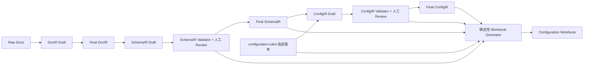

# 系统设计总览

## Status

Draft.

## 1. 设计目标

系统支持一条可审计的人机协同链路：LLM 将银行文档整理为 Draft，Validator 和人工 Review 形成 Final SchemaIR 与 Final ConfigIR，确定性 Generator 再生成 Configuration Workbook。



完整的修正和重新校验闭环以 `docs/01-requirements.md` 为准。

系统采用两个事实源：

- Final SchemaIR 保存银行 XML 报文结构与银行原始约束。
- Final ConfigIR 保存目标系统字段配置与规则依据。

Configuration Workbook 是派生交付物，不是事实源，也不是可导入文件。

## 2. 模块边界

### 2.1 Input / Workspace

职责：

- 接收 `.md`、`.txt` 或粘贴文本。
- 保存 raw doc 和任务上下文。
- 为 Draft、Final、Validator result 和 workbook 提供可追溯 artifact 边界。

不负责解释银行字段或目标系统规则。

### 2.2 LLM Draft Generators

职责：

- 从 Raw Docs 生成 DocIR Draft。
- 从 Final DocIR 生成 SchemaIR Draft。
- 从 Final SchemaIR 与指定版本自然语言规则包生成 ConfigIR Draft。

约束：

- 只能输出 Draft。
- 不得在缺少 catalog 时推断字段、function 或 mapping。
- 输出必须先经过结构校验，再进入人工 Review。
- 不保存最终可信状态，不生成最终工作簿。

### 2.3 Validators

SchemaIR Validator 负责 SchemaIR 结构、枚举、路径、父子关系和确定性 invariant。

ConfigIR Validator 负责：

- ConfigIR 结构与递归表达式合法性；
- SchemaIR path 引用存在；
- Rule ID 属于指定规则版本；
- FIELD、FUNCTION 和 MAPPING 引用存在于 catalog；
- required/length 等差异具有原因、规则依据和 Review 结论；
- 未确定或未确认配置不能成为 Final。

Validator 不判断某个 function 或 mapping 是否符合业务语义；该判断必须由人工 Review 完成。

### 2.4 Review Workbench

候选职责：

- 展示、编辑和确认 DocIR。
- 展示 SchemaIR Validator 结果，修改并重新校验 SchemaIR。
- 展示 ConfigIR、规则依据、SchemaIR 差异和 ConfigIR Validator 结果，修改并重新校验 ConfigIR。
- 预览和下载 Configuration Workbook。

Phase0 可以用受控 fixture 或命令流程表达人工确认；Phase1 才提供 UI。

### 2.5 Workbook Generator

输入：

- Final SchemaIR；
- Final ConfigIR；
- 与两份 Final 内容匹配的通过校验结果；
- 精确的 configuration-rules 版本；
- 生成时间等非业务任务上下文。

职责：

- 稳定排序和分 sheet；
- 将 SchemaIR 与 ConfigIR 字段按 path 对齐；
- 展开递归 Value Expressions；
- 汇总差异、未映射项、规则冲突和 Validator issue；
- 生成执行与验证清单。

禁止：

- 补业务字段或临时推断 Value Mode；
- 替换缺失的 Rule ID 或 catalog 引用；
- 对接目标系统 API 或导入格式；
- 反向读取 Excel 更新 Final ConfigIR。

## 3. 规则资产边界

正式规则资产位于仓库顶层 `configuration-rules/`。`docs/reference/` 不是规则来源。

规则版本一旦发布不可原地覆盖。ConfigIR 和 Configuration Workbook 必须记录精确规则版本以及使用到的稳定 Rule ID。当前 catalog 未提供，因而 ConfigIR contract、ConfigIR Validator 和 Workbook Generator 仍受阻，不得以历史导出 JSON 代替。

## 4. 候选任务状态

以下状态表达核心产物边界，wire name 可在实现 spec 中细化：

```text
RAW_DOC_CREATED
DOCIR_DRAFT_GENERATED
DOCIR_CONFIRMED
SCHEMAIR_DRAFT_GENERATED
SCHEMAIR_VALIDATED
SCHEMAIR_CONFIRMED
CONFIGIR_DRAFT_GENERATED
CONFIGIR_VALIDATED
CONFIGIR_CONFIRMED
CONFIGURATION_WORKBOOK_GENERATED
```

任何 Draft 被修改后，对应 validation 状态必须失效并重新计算。

## 5. 候选 Workspace 结构

```text
workspace/{taskId}/
├── raw-doc.md
├── docir-draft.md
├── docir-final.md
├── schemair-draft.json
├── schemair-validation-result.json
├── schemair-final.json
├── configir-draft.json
├── configir-validation-result.json
├── configir-final.json
└── configuration-workbook.xlsx
```

这是候选 artifact 结构，不是已经实现的完整协议。当前 bootstrap 只实现 README 中列出的 artifact。

## 6. 分阶段交付

- Phase0-PoC：文件 workspace、受控 fixture、双 Validator、确定性 Workbook Generator 和结构化 golden regression。
- Phase1-MVP：增加 DocIR、SchemaIR、ConfigIR Review UI 与工作簿预览/下载。
- Phase2-Pilot：在受控真实项目中验证人工修改率、规则选择质量和规则版本影响。
- Phase3-Production：暂不定义。
