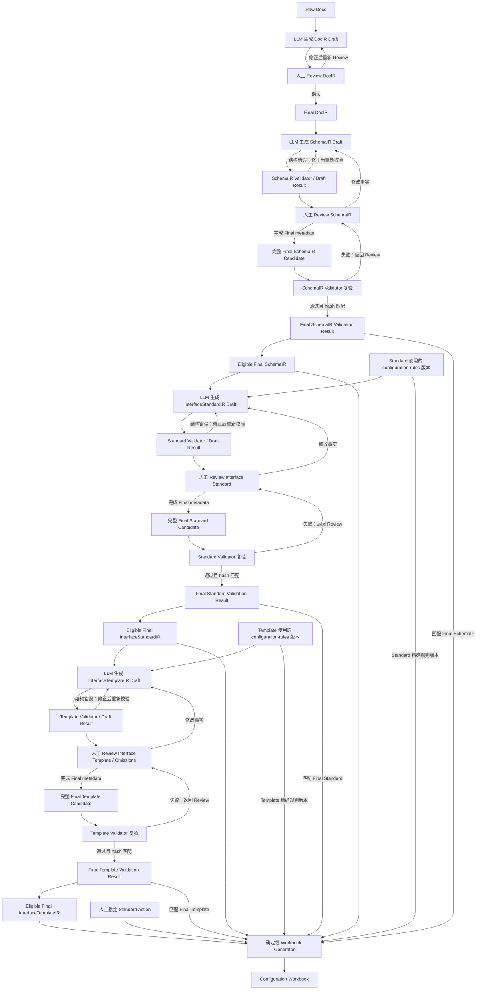

# 系统设计总览

## Status

Draft.

## 1. 设计目标

系统由输入与 artifact workspace、LLM Draft Generators、Human Review Boundary、Validators、版本化规则资产和确定性 Workbook Generator 协作完成配置辅助链路。

目标系统的操作顺序是先配置接口标准，再配置引用该标准的接口模板。系统设计必须保留这一依赖，不能把银行报文事实、目标结构配置和转换配置压缩成一个模型。



上图表达组件职责和数据流；`docs/01-requirements.md` 中的可信流程是唯一规范性生命周期图。关键顺序为：

```text
Final SchemaIR
→ InterfaceStandardIR Draft / Validator / Review / Final
→ InterfaceTemplateIR Draft / Validator / Review / Final
→ Configuration Workbook
```

系统采用三个顺序关联的配置事实源：

- Final SchemaIR：银行 XML 报文结构、方向级 `messages[].xmlEncoding` 与银行原始约束。
- Final InterfaceStandardIR：一个 `interfaceCode + direction` 的目标系统接口标准，包括银行文档明确条件约束。
- Final InterfaceTemplateIR：一份模板的方向性 source/target、取值、处理和适用的 ASSEMBLY omission 决策。

Configuration Workbook 是派生交付物，不是事实源，也不是可导入文件。

## 2. 模块边界

### 2.1 Input / Workspace

职责：

- 接收 `.md`、`.txt` 或粘贴文本。
- 保存 raw doc 和任务上下文。
- 为 Draft、Final、Validator result 和 workbook 提供可追溯 artifact 边界。

不负责解释银行字段或目标系统规则。

### 2.2 LLM Draft Generators

职责：

- 从 Raw Docs 生成 DocIR Draft。
- 从 Final DocIR 生成 SchemaIR Draft。
- 从 Final SchemaIR 与指定规则版本生成 InterfaceStandardIR Draft。
- 从 Final InterfaceStandardIR、方向性 FIELD catalog 与指定规则版本生成 InterfaceTemplateIR Draft。

约束：

- 只能输出 Draft。
- Template generator 必须精确绑定已确认的标准版本。
- 不得在缺少 catalog 事实时根据相近名称推断字段、function、mapping 或业务 Condition。
- 输出必须经过结构校验和人工 Review。
- 不生成最终工作簿。

### 2.3 Validators

SchemaIR Validator 负责 SchemaIR 结构、枚举、完整 path、父子关系和确定性 invariant。

Standard Validator 负责：

- `interfaceCode`、direction、standard identity 和版本绑定；
- `fieldId`、parentPath、fullPath、sequence 和层级关系；
- `Node`、`Object` 与标量类型和 SchemaIR 结构一致；
- 当前 XML 标准不使用 JSON-only `List`；
- XML Keys 能追溯到 SchemaIR attribute；
- 约束状态不是未确认的 `UNKNOWN`；
- SchemaIR/Standard 差异具有原因、Rule ID 和 Review 结论。
- 银行条件引用、operator/effect、literal 和 evidence 合法，但 Validator 不执行条件。
- raw-doc 未写的约束在已审查范围内投影为 `NO_CONSTRAINT`；证据冲突或无法判定时保持 `UNKNOWN` 并阻止 Final。

Template Validator 负责：

- Template 精确引用 Final Standard 的 ID、version 和 content hash；
- 每个配置行显式保存的 `standardProjection.required/length/dataType` 与绑定 Standard 完全一致；
- `VALUE | STRUCTURE_ONLY | COLLECTION_ITEM` 的结构绑定与方向、Standard 类型和 Parse target 相容；
- ASSEMBLY target Standard Field 引用存在且不重复；
- PARSE target Parse Field 引用存在、path/datatype 与 catalog 相容，表达式内 Standard FIELD_REF 存在；
- Value Expression 树、递归关系和顺序合法；
- String/Boolean/Date/Number 标量模板行必须有字段值表达式，Node/Object 模板行不得有字段值表达式；
- FIELD、FUNCTION、`mappingRuleName` 与 Rule ID 引用属于指定 catalog/规则版本；Function/MAPPING/Replacement 输入输出满足 String 和单规则约束；
- 存在模板行时，每个标准 XML Key 恰好具有一个表达式；
- 缺失 ASSEMBLY 标量 Standard Field 均有 omission Warning；未确认 omission 不能成为 Final；Node/Object 不参加 omission coverage，未配置 Parse Field 不自动产生 omission；
- 有 XML Key 或结构绑定需求的 Node/Object 必须有适用结构行：普通容器使用 `STRUCTURE_ONLY`，Parse collection source 使用 `COLLECTION_ITEM`；缺失 XML Key 配置直接报错，不伪装成 omission；
- `FIXED_VALUE` payload 必须在 `LITERAL` 与 `SECURE_INPUT_REF` 中二选一，安全输入只保存引用标识；
- 已确认 omission 与 `EMPTY` 保持不同语义。

Validator 不判断某个 function、mapping、目的系统业务 Condition 或字段省略是否符合业务语义；该判断必须由人工 Review 完成。

### 2.4 Review Workbench

候选职责：

- 展示、编辑和确认 DocIR。
- 展示 SchemaIR Validator 结果，修改并重新校验 SchemaIR。
- Review Interface Standard 的路径、类型、XML Keys、约束状态、差异和 Validator 结果。
- Review Interface Template 的字段表达式、XML Key 表达式、规则依据、处理策略和 omissions。
- 对每个 omission 保存原因与接受/拒绝结论。
- 预览和下载 Configuration Workbook。

Phase0 可以用受控 fixture 或命令流程表达人工确认；Phase1 才提供 UI。任何 Draft 被修改后，都必须重新进入对应 Validator。

### 2.5 Workbook Generator

输入：

- Final SchemaIR；
- Final InterfaceStandardIR；
- 选定的 Final InterfaceTemplateIR；
- 与三份 Final 内容匹配的通过校验结果；
- Standard 与 Template 实际使用的精确规则版本；
- 调用者显式指定的 `Standard Action = CREATE | REUSE | UPDATE`；
- 生成时间等非业务任务上下文。

职责：

- 为一个方向模板生成一份 `.xlsx`；
- 输出绑定标准的完整快照和模板实际字段子集；
- 在 `Overview` 展示 Final SchemaIR 的方向级 XML encoding，不生成伪 Standard 字段；
- 在 Template sheet 分列展示 Standard 快照、Template 镜像、Parse target 和 Value Expression，避免混合两端类型；
- 将标量字段值与 XML Key 的递归表达式展开到 `Value Expressions`；
- 汇总差异、银行条件、ASSEMBLY omissions、规则冲突、不确定项和 Validator issue；
- 生成执行与验证清单。

禁止：

- 补业务字段或临时推断 Value Mode；
- 替换缺失的 Rule ID 或 catalog 引用；
- 连接目标系统推断 Standard Action；
- 把 omission 转换为 `EMPTY`；
- 反向读取 Excel 更新任何 Final IR；
- 输出或承诺目标系统 Import JSON。

## 3. 规则资产边界

正式规则资产位于仓库顶层 `configuration-rules/`。`docs/reference/` 可以提供 raw-doc、正式导出和 catalog 样例等 Review 证据，但未经规则治理不能成为 Final IR 的规则来源。

规则版本一旦发布不可原地覆盖。InterfaceStandardIR、InterfaceTemplateIR、Validator result 和 Configuration Workbook 必须记录实际使用的精确规则版本及 Rule ID。标准和后续模板可以使用不同规则版本，但模板对标准 artifact 的绑定不因此改变。

`configuration-rules/v1` 已发布并冻结；SchemaIR v2 runtime 与已评审 Final fixture、InterfaceStandardIR wire/Validator 和双方向 Final fixture 已实现并冻结。InterfaceTemplateIR wire/Validator、Final fixture 和 Workbook Generator 仍处于 P0-T3 后续批次。Final IR 必须精确引用适用的 `RELEASED` 规则版本；正式导出只能作为经治理的目标配置证据，不能直接代替 IR 或 Generator 输入。

## 4. 候选任务状态

以下状态表达核心产物边界，wire name 可在实现 spec 中细化：

```text
RAW_DOC_CREATED
DOCIR_DRAFT_GENERATED
DOCIR_CONFIRMED
SCHEMAIR_DRAFT_GENERATED
SCHEMAIR_DRAFT_VALIDATED
SCHEMAIR_CONFIRMED
SCHEMAIR_FINAL_VALIDATED
STANDARD_DRAFT_GENERATED
STANDARD_DRAFT_VALIDATED
STANDARD_CONFIRMED
STANDARD_FINAL_VALIDATED
TEMPLATE_DRAFT_GENERATED
TEMPLATE_DRAFT_VALIDATED
TEMPLATE_CONFIRMED
TEMPLATE_FINAL_VALIDATED
CONFIGURATION_WORKBOOK_GENERATED
```

任何 Draft 或完整 Final candidate 被修改后，对应 validation 状态必须失效并重新计算。只有 Final 内容的 identity/version/contract/hash 与复验结果全部匹配且 `finalEligible=true`，才能进入下游；标准版本变化不会自动迁移或重新解释已有模板。

## 5. 候选 Workspace 结构

```text
workspace/{taskId}/
├── raw-doc.md
├── docir-draft.md
├── docir-final.md
├── schemair-draft.json
├── schemair-validation-result.json
├── schemair-final.json
├── standards/{direction}/{standardVersion}/
│   ├── standard-draft.json
│   ├── standard-validation-result.json
│   └── standard-final.json
└── templates/{direction}/{templateId}/{templateVersion}/
    ├── template-draft.json
    ├── template-validation-result.json
    ├── template-final.json
    └── configuration-workbook.xlsx
```

根级 SchemaIR artifact 名称和 library JSON I/O 已实现；Standard/Template 子目录仍是待后续批次冻结的结构。完整 `phase0` CLI profile 不扫描目录或自动选择最新版，将在 Workbook 批次通过显式 direction/version/template selector 启用。

## 6. 分阶段交付

- Phase0-PoC：文件 workspace、受控 fixture、三个 Validator、确定性 Workbook Generator 和结构化 golden regression。
- Phase1-MVP：增加四类 IR Review、omission Review 与工作簿预览/下载。
- Phase2-Pilot：验证标准复用、模板接受率、omission 质量、规则版本影响和人工返工量。
- Phase3-Production：暂不定义。
