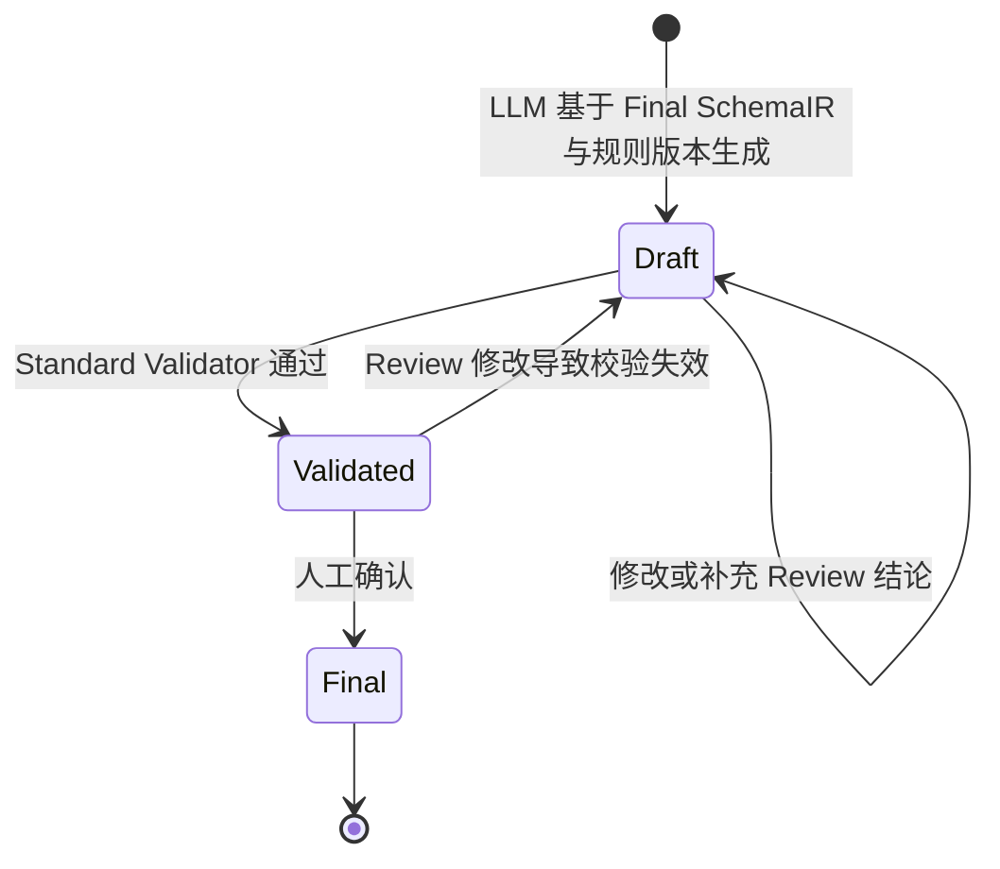
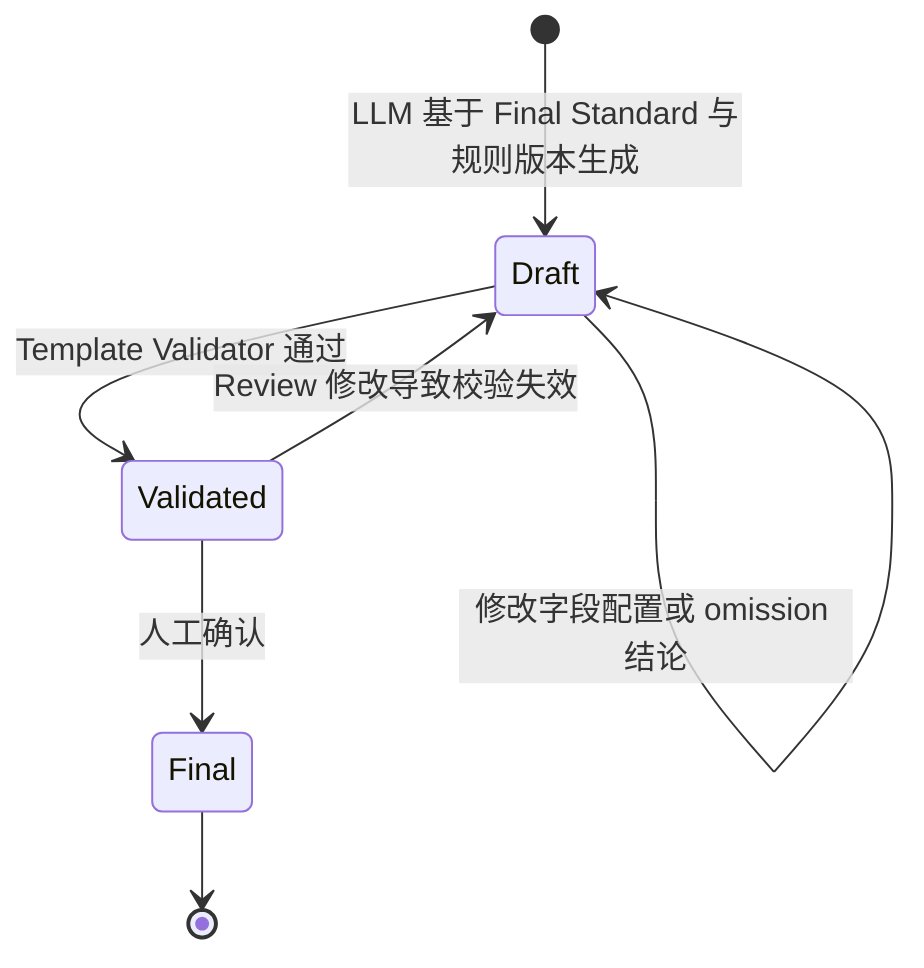

# 接口标准与接口模板模型设计

## Status

Draft. Logical contract confirmed; machine wire schemas remain blocked by the unavailable `configuration-rules/v1` catalog.

## 1. 目的与边界

目标系统配置分为两个有顺序的模型：

- InterfaceStandardIR 定义报文字段格式和层级结构。
- InterfaceTemplateIR 定义一份模板如何对已确认的标准字段进行取值和处理。

两者不包含连接、认证、证书、部署、目标系统 API、Import JSON 或全量系统配置。SchemaIR 继续保存银行原始事实，目标配置不得回写覆盖 SchemaIR。

## 2. 生命周期与身份

### 2.1 Interface Standard



每个标准由 `standardId + version` 唯一标识，并属于一个 `interfaceCode + direction`。Final 版本不可原地覆盖；内容摘要用于防止模板错误绑定同名但不同内容的标准。

### 2.2 Interface Template



每份模板由 `templateId + version` 唯一标识，属于一个 `interfaceCode + direction`，并精确引用 `standardId + standardVersion + contentHash`。

一个标准可以被多份同方向模板复用。新增模板直接消费已有 Final Standard；标准发布新版本不会自动迁移或重新解释旧模板。

## 3. InterfaceStandardIR

### 3.1 逻辑结构

```text
InterfaceStandardIR
├── standardId
├── interfaceCode
├── direction
├── version
├── schemaIrReference + schemaIrContentHash
├── rulePackageVersion
├── fields[]
│   ├── fieldId
│   ├── sequence
│   ├── fieldName / fieldDescription
│   ├── parentPath / fullPath
│   ├── required
│   ├── lengthLimit
│   ├── illegalCharacters
│   ├── xmlKeys[]
│   ├── regex
│   ├── dataType
│   └── evidence / differences / review
└── review
```

这些字段描述逻辑契约，不是已经冻结的 JSON wire schema。

### 3.2 Path 与层级

目标系统配置的 Path 是当前字段的父路径：

| Field | Data Type | Parent Path | Full Path |
|---|---|---|---|
| `Document` | `Object` | `Root` | `Root.Document` |
| `pain.001.001.02` | `Object` | `Root.Document` | `Root.Document.pain.001.001.02` |
| `MsgId` | `String` | `Root.Document.pain.001.001.02.GrpHdr` | `Root.Document.pain.001.001.02.GrpHdr.MsgId` |
| `PmtInf` | `Node` | `Root.Document.pain.001.001.02` | `Root.Document.pain.001.001.02.PmtInf` |

`parentPath + fieldName` 用于解释层级；`fullPath` 用于唯一定位和审计。模板不得使用可能产生歧义的显示名称引用标准字段，而必须使用 stable `fieldId`。

同一父节点下使用 `sequence` 保存 XML 输出顺序。sequence 必须是唯一、连续的正整数，不能依赖 JSON object 属性顺序或 Workbook 当前行号。

### 3.3 数据类型

| 类型 | XML 语义 |
|---|---|
| `String` | 字符串叶子。 |
| `Boolean` | 布尔叶子。 |
| `Date` | 日期叶子；具体格式保留规则依据。 |
| `Number` | 数值叶子。 |
| `Node` | 可重复出现的无值容器节点。 |
| `Object` | 不可重复的无值容器节点。 |
| `List` | JSON-only；当前 XML Final Standard 禁止使用。 |

容器类型可根据 Final SchemaIR 的 children、value 和 occurs 确定。标量类型或 Date 格式信息不足时必须标记 `UNKNOWN`，不得依据相近字段名猜测。

### 3.4 XML Keys

XML attribute 在 SchemaIR 中仍是独立银行报文事实；目标系统接口标准不为它创建独立字段行，而把名称挂在所属 element 的 `xmlKeys` 中，例如：

```text
fieldId: document-field
fieldName: Document
xmlKeys: [@version, @locale]
```

XML Keys 必须能追溯到 SchemaIR attribute。key 的值不属于接口标准，由绑定模板中的 XML Key Value Expression 定义。

### 3.5 约束与差异

Required、Length Limit、Illegal Characters、Regex 和 Data Type 是目标系统实际接口标准配置；SchemaIR 中的对应值仍保留为银行原始事实。

可能缺失的约束使用三态语义：

| 状态 | 含义 | 是否允许 Final |
|---|---|---|
| `VALUE` | 有明确配置值。 | 是。 |
| `NO_CONSTRAINT` | 人工确认无该约束。 | 是。 |
| `UNKNOWN` | 尚无法确定。 | 否。 |

SchemaIR 与 Standard 值不一致时必须记录：

- SchemaIR source reference 和原值；
- Standard 配置值；
- Difference Reason；
- Rule References；
- confidence / uncertain reason；
- 人工 Review 结论。

## 4. InterfaceTemplateIR

### 4.1 逻辑结构

```text
InterfaceTemplateIR
├── templateId
├── interfaceCode
├── direction
├── version
├── standardRef
│   ├── standardId
│   ├── version
│   └── contentHash
├── rulePackageVersion
├── fieldConfigs[]
│   ├── standardFieldRef
│   ├── valueExpression?          # 仅 String/Boolean/Date/Number
│   ├── xmlKeyExpressions{}
│   ├── processingPolicies
│   └── evidence / review
├── omissions[]
└── review
```

### 4.2 字段子集与 omission

`fieldConfigs` 是标准字段集合的子集。同一 `standardFieldRef` 最多出现一次；缺失字段不是自动错误，也不生成空模板行。

Template Validator 为每个未覆盖标准字段产生 `MISSING_TEMPLATE_FIELD` Warning 和 omission candidate。omission 至少包含：

- Standard Field Reference；
- Omission Reason；
- Review Disposition；
- Review Note；
- reviewer / reviewed-at 等审计信息的候选位置。

未确认 omission 阻止 Final Template。人工确认该业务场景确实不需要字段后，omission 允许进入 Final，并继续显示在 Workbook Warnings。

必须区分：

- omission：没有模板行，不配置该字段；
- `EMPTY`：存在模板行，字段明确取空值；
- Empty Handling：存在源值为空时的处理策略。

### 4.3 Value Expression

String、Boolean、Date、Number 标量 field config 必须具有一个字段值表达式。`Node`、`Object` 是无值容器，不具有字段值表达式；Validator 必须拒绝容器 field config 中出现 `valueExpression`。容器仍可保存适用的 Processing Policies，并按 4.4 节配置 XML Key Expressions。

| Mode | 语义 | 必要内容 |
|---|---|---|
| `FIXED_VALUE` | 使用明确固定值。 | 固定值。 |
| `EMPTY` | 表达式明确取空值。 | 无。 |
| `FIELD` | 使用 catalog 中的业务字段。 | Field reference。 |
| `FUNCTION` | 调用 catalog 中的 function。 | Function reference 和结构化参数。 |
| `MAPPING` | 使用 catalog 中的 mapping。 | Mapping reference。 |
| `CONCATENATE` | 按顺序组合子表达式。 | 一个或多个有序子表达式，可递归。 |

ASSEMBLY 和 PARSE 使用同一结构，但解释方向不同：ASSEMBLY 从系统数据形成报文字段；PARSE 从报文字段形成系统接收数据。

### 4.4 XML Key Expressions

若标准字段存在模板行，则标准定义的每个 XML Key 必须恰好具有一个独立 Value Expression。标量字段值表达式与 XML Key 表达式共享六种 Mode，但使用不同 Scope。Node/Object 没有字段值表达式，但不影响其 XML Key 使用这些 Mode。

```text
standardFieldRef: document-field
fieldValueExpression: ...
xmlKeyExpressions:
  @version: FIXED_VALUE("1.0")
  @locale: FIELD(<catalog-field-ref>)
```

引用标准未定义的 key 或缺少已定义 key 均为 Validator error。若整个字段具有已确认 omission，其 keys 随字段一起省略。

### 4.5 Processing Policies

模板行保存转换和赋值阶段的处理策略：

- Empty Handling；
- Overlength Handling；
- Row Limit；
- Chinese Character Length；
- Ordered Replacement Rules。

Required、Length Limit、Illegal Characters、Regex 和目标 Data Type 属于 InterfaceStandardIR，不在模板中重复定义或覆盖。

## 5. Validator 边界

Standard Validator 必须校验：

- identity、direction、SchemaIR 和规则版本引用；
- fieldId、parent/full path、sequence 与层级；
- Node/Object/标量类型和 XML-only 限制；
- XML Keys 与 SchemaIR attribute 的对应关系；
- 约束状态和 SchemaIR/Standard 差异记录；
- 所有 Final 决定均已完成人工 Review。

Template Validator 必须校验：

- standard ID、version 和 content hash 精确匹配；
- field reference 存在且不重复；
- 表达式结构、递归顺序和 catalog 引用；
- String/Boolean/Date/Number field config 必须有字段值表达式，Node/Object field config 不得有字段值表达式；
- XML Key expressions 完整且无未知 key；
- 每个缺失标准字段都有 omission Warning；
- 每个 Final omission 已记录原因和接受结论；
- uncertain、规则冲突或未确认配置不能成为 Final。

Validator 不能判断 function、mapping 或 omission 是否符合业务语义；这类决定必须由人工 Review。

## 6. Final 条件

Final InterfaceStandardIR 必须满足：

- Standard Validator 通过且结果与当前内容匹配；
- 不含 `UNKNOWN` 约束；
- 差异和推导均有规则依据与人工结论；
- 标准身份和版本已冻结。

Final InterfaceTemplateIR 必须满足：

- Template Validator 通过且结果与当前内容匹配；
- 绑定的 Final Standard identity/version/hash 精确匹配；
- 所有适用的标量字段值和 XML Key expression 引用有效，Node/Object 不包含字段值表达式；
- 每个未覆盖标准字段都有已确认 omission；
- function、mapping 和其他业务语义已人工确认；
- 模板身份和版本已冻结。

标准、模板或规则版本变化后，旧校验结果失效。不得通过原地覆盖 Final artifact 绕过迁移和重新 Review。
