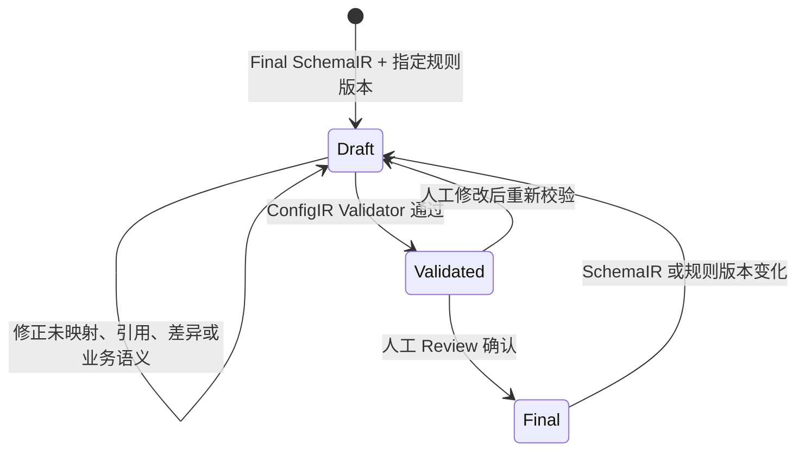

# 系统配置模型设计

## Status

Draft. Logical contract confirmed; machine wire schema is blocked until the target-system catalog is provided and `configuration-rules/v1` is reviewed.

## 1. 目的

ConfigIR 是目标系统字段配置的结构化模型，回答“当前目标系统应如何配置这个银行 XML 报文字段”。

ConfigIR 不是：

- 银行报文结构模型；
- 连接、认证、证书、部署或全量系统配置；
- 目标系统 Import JSON；
- Excel 中人工执行状态的副本。

Final SchemaIR 与 Final ConfigIR 共同驱动 Configuration Workbook，但两者各自保存自己的事实，不互相覆盖。

## 2. 生命周期



规则：

- LLM 只能生成 ConfigIR Draft。
- Draft 必须固定一个 `rulePackageVersion`。
- Validator 通过后仍需人工判断 FIELD、FUNCTION、MAPPING 和组合表达式是否符合业务语义。
- 任何内容修改都会使旧 validation result 失效。
- SchemaIR 内容或规则版本变化时，已有 Final ConfigIR 不能静默沿用，必须重新生成或显式迁移并重新 Review。

## 3. 逻辑结构

具体 JSON wire schema 在真实 catalog 确认后设计。本阶段确认以下逻辑结构：

```text
ConfigIR
├── interfaceCode
├── schemaIrRef
├── rulePackageVersion
├── directions
│   ├── ASSEMBLY
│   │   └── fieldConfigs[]
│   └── PARSE
│       └── fieldConfigs[]
└── review
```

每个 `fieldConfig` 必须唯一引用一个 SchemaIR `path`，并包含 Value Expression、字段处理策略、规则引用、可信信息、差异信息和人工 Review 结论。

## 4. Value Expression

ASSEMBLY 与 PARSE 使用相同表达模型。

| Mode | 含义 | 必需引用或值 |
|---|---|---|
| `FIXED_VALUE` | 使用明确固定值。 | 固定值；固定空值应使用 `EMPTY`。 |
| `EMPTY` | 该表达式明确取空值。 | 无。它不等于 Empty Handling。 |
| `FIELD` | 直接使用目标系统业务字段。 | `fields.md` 中存在的字段标识。 |
| `FUNCTION` | 调用目标系统支持的 function。 | `functions.md` 中存在的 function 标识和参数。 |
| `MAPPING` | 应用目标系统 mapping。 | `mappings.md` 中存在的 mapping 标识，以及 catalog 明确要求的参数。 |
| `CONCATENATE` | 按顺序拼接子表达式。 | 一个或多个有序子表达式。 |

`CONCATENATE` 的子表达式可以使用任意 Mode，包括继续嵌套 `CONCATENATE`。每个表达式节点都必须有稳定的 Expression ID；子节点保存 Parent Expression ID 和 Sequence，以便 Validator 与 Workbook 在不依赖自由文本的情况下还原同一棵树。

自然语言摘要只用于展示，不能替代结构化表达式。

## 5. 字段处理策略

每个字段配置必须显式表达适用的策略：

| 策略 | 含义 |
|---|---|
| Configured Required | 目标系统实际配置的必填值。 |
| Empty Handling | 表达源值为空时“报送空值”或“删除字段”等处理。 |
| Overlength Handling | 超长时报错或截断。 |
| Configured Length | 目标系统实际配置的长度限制。 |
| Row Limit | 重复节点或多行数据的配置上限。 |
| Chinese Character Length | 一个中文字符按多少长度计数。 |
| Illegal Characters | 目标系统配置的非法字符列表。 |
| Replacement Rules | 有序字符替换规则；执行顺序是配置语义的一部分。 |

策略未适用时必须使用明确的“不适用”表达，不能与“资料缺失”混为一谈。确切枚举和空值表示在 wire schema 设计时冻结。

## 6. 证据与规则引用

ConfigIR 每个可追溯决定必须记录：

- `rulePackageVersion`；
- 一个或多个稳定 Rule ID；
- confidence；
- uncertain；
- uncertain reason；
- 人工 Review 状态和结论。

Rule ID 必须来自当前规则版本，FIELD、FUNCTION、MAPPING 引用必须来自同版本 catalog。LLM 给出的自然语言解释不能替代规则引用。

当前 catalog 尚未提供，因此不得创建任何占位业务字段、function、mapping 或伪 Rule ID。缺少这些资料的配置只能保持未确定状态。

## 7. SchemaIR 与 ConfigIR 差异

SchemaIR 保存银行原始约束，ConfigIR 保存目标系统实际配置。以下情况允许不同，但必须显式处理：

- Bank Required 与 Configured Required 不同；
- Bank Length 与 Configured Length 不同；
- 银行允许重复次数与 Row Limit 不同；
- 银行字符约束与目标系统非法字符、替换或截断策略不同。

差异处理规则：

1. 保留 SchemaIR 原值和 ConfigIR 配置值。
2. ConfigIR 记录 Difference Reason 和 Rule Reference。
3. 差异进入 Configuration Workbook `Warnings`。
4. 人工 Review 明确接受、拒绝或要求修正。
5. 未确认差异阻止 Final ConfigIR。

## 8. Validator 边界

ConfigIR Validator 必须校验：

- 顶层结构、方向枚举和字段配置唯一性；
- SchemaIR path 引用存在且方向一致；
- Value Expression Mode 和递归树合法，无孤儿、重复 Sequence 或循环；
- FIXED_VALUE、FIELD、FUNCTION、MAPPING 各自所需值和引用完整；
- Rule ID 属于指定规则版本；
- FIELD、FUNCTION、MAPPING 引用存在于对应 catalog；
- 字段策略枚举和值域合法，有序 replacement 的顺序明确；
- SchemaIR/ConfigIR 差异包含原因、规则引用和 Review 结论；
- uncertain、未映射、规则冲突或 PENDING Review 不得形成 Final。

Validator 不负责：

- 猜测缺失 catalog；
- 选择最合适的业务字段；
- 判断 function 参数的业务含义是否正确；
- 判断 mapping 的业务对应关系是否正确；
- 用常见实践覆盖自然语言规则。

这些判断必须由人工 Review 完成。

## 9. Final 条件

ConfigIR 只有同时满足以下条件才能成为 Final：

- 引用的 Final SchemaIR 已通过校验且内容未变化；
- 指定规则版本真实存在并已由业务负责人确认；
- ConfigIR Validator 通过；
- 所有 FIELD、FUNCTION、MAPPING 引用可解析；
- 所有差异、规则冲突和不确定项已有人工结论；
- 人工 Review 已确认整体配置。
