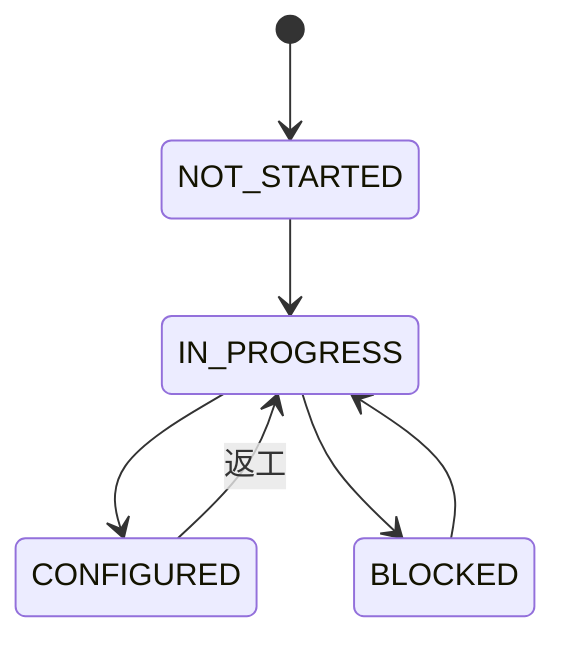
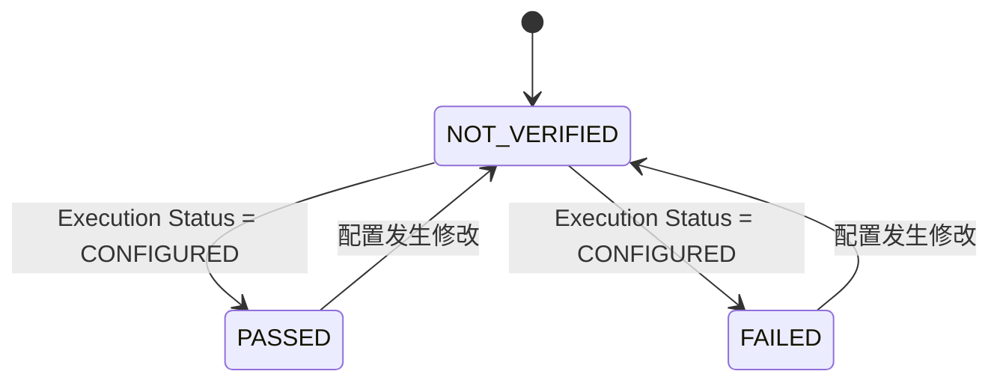

# Configuration Workbook 设计

## Status

Draft. Product contract confirmed; generation remains blocked by the unavailable `configuration-rules/v1` catalog and Final ConfigIR fixture.

## 1. 目的与边界

Configuration Workbook 是供配置人员使用的配置规格和执行清单。每个银行接口生成一个 `.xlsx`。

它由以下输入确定性生成：

- Final SchemaIR；
- Final ConfigIR；
- 与两份 Final 内容匹配的通过校验结果；
- 指定的 configuration-rules 版本；
- 生成时间等非业务任务上下文。

工作簿不是事实源，不是目标系统可导入文件，也不反向更新 ConfigIR。Workbook Generator 不得临时补字段、选择 Value Mode、猜测 Rule ID 或对接目标系统。

## 2. 固定 Sheet

| Sheet | 用途 |
|---|---|
| `Overview` | 接口、报文格式、输入模型版本、规则版本、生成信息和校验摘要。 |
| `ASSEMBLY` | 请求报文每个 XML node/attribute 的结构、系统配置和执行清单。 |
| `PARSE` | 响应报文每个 XML node/attribute 的结构、系统配置和执行清单。 |
| `Value Expressions` | 将所有取值表达式按树展开，完整保存递归 `CONCATENATE`。 |
| `Warnings` | 未映射、规则冲突、差异、不确定项和 Validator issue。 |
| `Rule References` | 本工作簿实际使用的规则版本、Rule ID、标题和来源位置。 |
| `Legend` | 列、枚举、状态、颜色和空值约定。 |

即使某个接口只有一个方向，也保留全部固定 sheet，并在 `Overview` 标记缺失方向。

不新增 `ENVELOPE` sheet。`ASSEMBLY` 与 `PARSE` 都先展示 SchemaIR envelope/head/trans，再展示当前方向交易消息，使配置人员在一个方向内看到完整 XML 结构。

## 3. 方向 Sheet

`ASSEMBLY` 和 `PARSE` 每个 SchemaIR XML element/attribute 一行，使用同一组列。

### 3.1 报文结构

| 列 | 来源 | 含义 |
|---|---|---|
| `Path` | SchemaIR | 完整唯一路径。 |
| `Field Name` | SchemaIR | element 或 attribute 名称。 |
| `Node Kind` | SchemaIR | `XML_ELEMENT`、`XML_ATTRIBUTE` 或适用的 scalar 表示。 |
| `Data Type` | SchemaIR | 银行报文字段的标准化类型。 |
| `Bank Required` | SchemaIR | 银行原始必填约束。 |
| `Bank Length` | SchemaIR | 银行原始长度，保留原文与解析值。 |
| `Occurs` | SchemaIR | 银行原始或经 Review 确认的出现次数。 |
| `Description` | SchemaIR | 字段说明。 |
| `Condition` | SchemaIR | 条件必填、枚举或其他银行约束。 |

### 3.2 系统配置

| 列 | 来源 | 含义 |
|---|---|---|
| `Value Mode` | ConfigIR | 六种取值模式之一。 |
| `Value Summary` | Generator | Value Expression 的确定性可读摘要。 |
| `Configured Required` | ConfigIR | 目标系统实际必填配置。 |
| `Empty Handling` | ConfigIR | 源值为空时的处理策略。 |
| `Overlength Handling` | ConfigIR | 超长时报错或截断。 |
| `Configured Length` | ConfigIR | 目标系统配置长度。 |
| `Row Limit` | ConfigIR | 重复节点或多行配置上限。 |
| `Chinese Character Length` | ConfigIR | 中文字符长度权重。 |
| `Illegal Characters` | ConfigIR | 非法字符列表。 |
| `Replacement Rules` | ConfigIR | 按执行顺序显示的替换规则。 |

`EMPTY` Value Mode 与 `Empty Handling` 是两个不同概念：前者表示表达式明确取空值，后者表示源值为空时如何处理。

### 3.3 可信信息

| 列 | 来源 | 含义 |
|---|---|---|
| `Rule Reference` | ConfigIR | 稳定 Rule ID，可有多个。 |
| `Difference Reason` | ConfigIR | SchemaIR 与 ConfigIR 约束不一致的原因。 |
| `Confidence` | ConfigIR | 配置决定的置信度。 |
| `Uncertain` | ConfigIR | 是否仍有不确定性。 |
| `Validator Issue` | validation results | 与该 path 相关的错误或警告摘要。 |

### 3.4 执行清单

| 列 | 填写方 | 含义 |
|---|---|---|
| `Execution Status` | 配置人员 | 当前配置执行状态。 |
| `Verification Status` | 配置/复核人员 | 配置完成后的验证状态。 |
| `Operator Note` | 配置/复核人员 | 阻塞原因、验证说明或返工记录。 |

执行状态和备注只存在于交付工作簿，不回流 Final ConfigIR。

## 4. Value Expressions

主 sheet 只显示 Value Mode 和可读摘要。`Value Expressions` 必须将表达式逐节点展开：

| 列 | 含义 |
|---|---|
| `Expression ID` | 当前表达式节点的稳定 ID。 |
| `Parent Expression ID` | 父节点 ID；根表达式为空。 |
| `Sequence` | 同一父节点下的执行顺序。 |
| `Mode` | `FIXED_VALUE`、`EMPTY`、`FIELD`、`FUNCTION`、`MAPPING` 或 `CONCATENATE`。 |
| `FIELD Reference` | FIELD catalog 引用。 |
| `Fixed Value` | FIXED_VALUE 的值。 |
| `Function Reference` | FUNCTION catalog 引用。 |
| `Function Parameters` | 结构化参数的确定性展示。 |
| `Mapping Reference` | MAPPING catalog 引用。 |
| `Rule Reference` | 支持该表达式节点的 Rule ID。 |

每行还应能关联方向和 SchemaIR Path。`CONCATENATE` 子节点按 Parent Expression ID 与 Sequence 还原；禁止把递归结构压成无法校验的自由文本。

## 5. Warnings

`Warnings` 至少包含：

| 列 | 含义 |
|---|---|
| `Severity` | `ERROR`、`WARNING` 或 `INFO`。 |
| `Function Type` | `ASSEMBLY` 或 `PARSE`。 |
| `Path` | 相关 SchemaIR path。 |
| `Category` | `UNMAPPED`、`RULE_CONFLICT`、`SCHEMA_CONFIG_DIFFERENCE`、`UNCERTAIN`、`VALIDATOR` 等稳定类别。 |
| `Message` | 可执行的问题说明。 |
| `Rule Reference` | 相关 Rule ID。 |
| `Source` | SchemaIR Validator、ConfigIR Validator、ConfigIR Review 或 Generator。 |

以下内容不得静默忽略，必须进入 Warnings：

- 未映射字段；
- 不存在或冲突的 FIELD、FUNCTION、MAPPING 引用；
- SchemaIR 与 ConfigIR 的 required、length 等差异；
- uncertain 或 confidence 低于 Review 阈值的配置；
- Validator warning；
- 缺少规则依据或人工 Review 结论的项。

存在 Validator `ERROR` 或未形成 Final ConfigIR 时，不得生成可交付工作簿。若为排障生成 debug workbook，`Overview` 必须明确标记为不可交付。

## 6. Rule References

`Rule References` 只列出当前工作簿实际引用的规则，至少包含：

- Rule Package Version；
- Rule ID；
- Rule Title；
- Source File；
- Source Section；
- Used By Direction；
- Used By Path。

规则文本以不可变规则包为准，工作簿中的摘要不得成为新的规则来源。

## 7. 状态流转

### 7.1 Execution Status

### 7.2 Verification Status

约束：

- 只有 `Execution Status=CONFIGURED` 才能进入 `PASSED` 或 `FAILED`。
- 配置发生修改后，Verification 必须重置为 `NOT_VERIFIED`。
- 一行真正完成的条件是 `CONFIGURED + PASSED`。
- workbook 中的人工状态不改变 Final ConfigIR。

## 8. 格式规则

- 冻结表头并启用筛选。
- 对 XML 层级提供稳定的视觉缩进，但以 `Path` 为结构依据。
- Bank Required、Configured Required、差异、不确定和 warning 使用可区分样式。
- 长文本允许换行，不得截断规则依据和差异原因。
- 不依赖公式表达关键配置语义。
- `Legend` 必须解释全部枚举、状态、颜色、空值和“不适用”约定。

## 9. 结构化回归

自动化测试不比较 `.xlsx` 整体二进制。测试读取 workbook 后至少断言：

- 七个固定 sheet 的名称和顺序；
- 方向 sheet 的完整表头；
- ASSEMBLY、PARSE 关键 XML path；
- 六种 Value Mode 均可渲染；
- 递归 `CONCATENATE` 能按 Expression ID、Parent ID 和 Sequence 还原；
- SchemaIR/ConfigIR 差异、未映射、规则冲突和 Validator warning 进入 `Warnings`；
- `Rule References` 中版本和 Rule ID 可追溯；
- 状态单元格的允许值与约束；
- 冻结窗格、筛选和基础提示样式；
- 相同 Final 输入和规则版本生成相同结构化内容。

人工查看用 expected xlsx 可以保留，但机器验收以结构化 assertions 为准。
